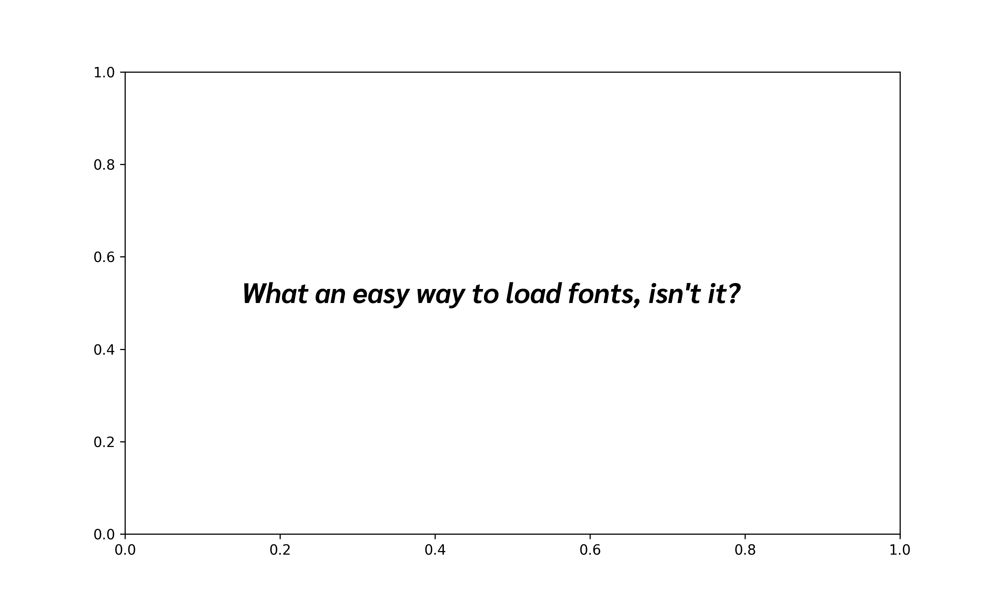

# pyfont

A simple way to load fonts for matplotlib.

<br>

## Usage

#### Load a font for a matplotlib chart:

```python
from pyfont import load_font
import matplotlib.pyplot as plt

# load font
font = load_font(family="Sarabun", style='italic', weight='bold')

# check how the font looks on a minimalist example
fig, ax = plt.subplots(figsize=(10, 6), dpi=200)
ax.text(
   x=0.15, y=0.5,
   s=f"What an easy way to load fonts, isn't it?",
   font=font,
   fontsize=20
)
plt.show()
```



<br>

#### Download a font locally:

```python
from pyfont import download_font
download_font(family="Sarabun", style='normal', weight='thin')
```

`Font installed at: /Users/josephbarbier/Desktop/pyfont/Sarabun_Thin.ttf`