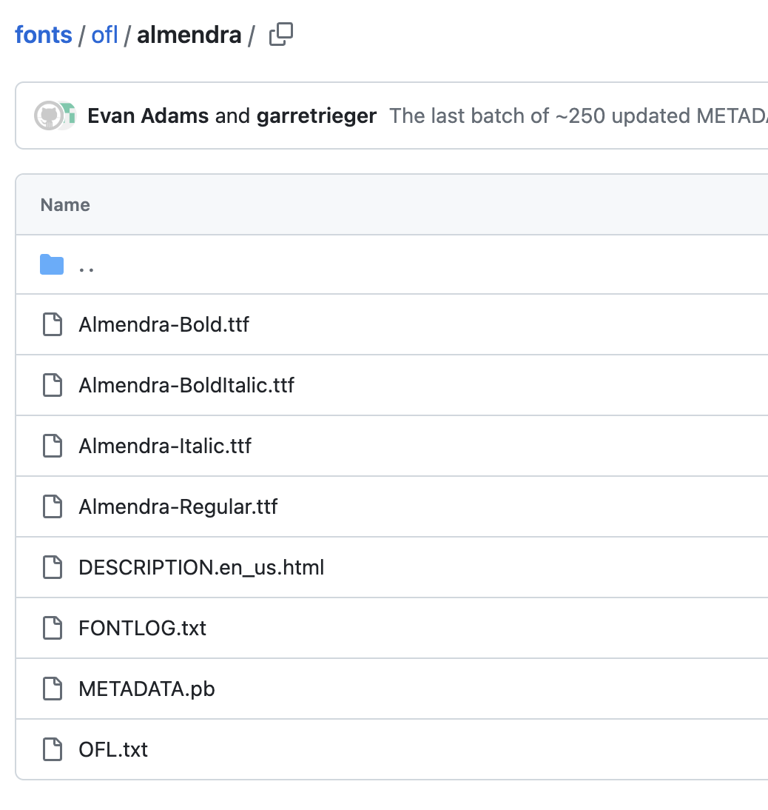
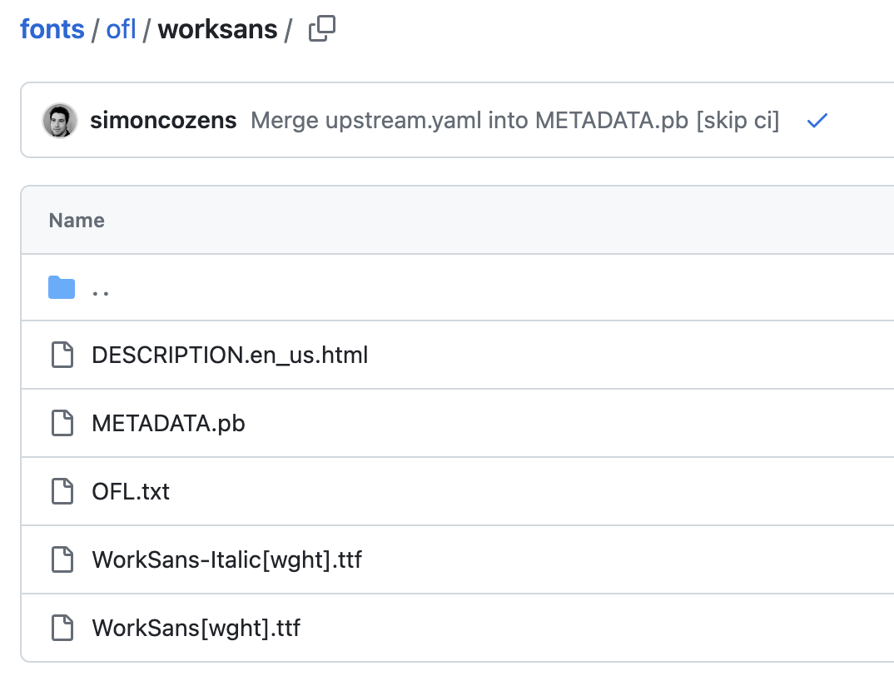

# pyfonts

A simple way to load fonts for matplotlib.

<br>

## Installation

```
pip install git+https://github.com/JosephBARBIERDARNAL/pyfonts.git
```

<br>

## Quick start

```python
from pyfonts import load_font
import matplotlib.pyplot as plt

# load font
font = load_font(family='Sarabun', style='italic', weight='bold')

# check how the font looks on a minimalist example
fig, ax = plt.subplots(figsize=(10, 6), dpi=200)
ax.text(
   x=0.15, y=0.5,
   s="What an easy way to load fonts, isn't it?",
   font=font,
   fontsize=20
)
plt.show()
```


<br>

## Which font is available?

`pyfonts` looks up to the [google font repository](https://github.com/google/fonts/). This repo stores numerous different fonts, with different weight/style, and different license. When using `load_font()`, it goes into the repo and tries to find your font.

For example, if you want to use the [Almendra](https://github.com/google/fonts/tree/main/ofl/almendra) font, you do:

```python
font = load_font(family='Almendra')
```

By default, it will search for the `Almendra-Regular.ttf` file in the [Almendra directory](https://github.com/google/fonts/tree/main/ofl/almendra).

The `style` and `weight` arguments are used to search for more specific font:

```python
load_font(family='Almendra', style='italic') # -> Almendra-Italic.ttf
load_font(family='Almendra', weight='bold') # -> Almendra-Bold.ttf
load_font(family='Almendra', weight='bold', style='italic') # -> Almendra-BoldItalic.ttf
# And so on
```

Example of the available fonts for family [Almendra](https://github.com/google/fonts/tree/main/ofl/almendra):



Unfortunately, since **not all fonts are available in all possible combinations**, if it does not exist, the code will raises an explicit error.

<br>

By default, the program uses `license='ofl'`, an argument used to determines in which directory of the google repo to look for. But one can perfectly change it to other directory names such `ufl` or `apache`. For example, the [Ultra font](https://github.com/google/fonts/tree/main/apache/ultra) is in the `apache` directory:

```python
# Does not work
font = load_font(family='Ultra')

# Works
font = load_font(family='Ultra', license='apache')
```

<br>

## Use font in matplotlib

Once you loaded your font, you just have to pass it to the font argument that can be used in most matplotlib functions used to display text:

```python
load_font(family='Almendra', style='italic')

ax.text(
   x=0.15, y=0.5,
   s="some text",
   font=font,
   fontsize=20
)
```

<br>

## Specifying the `[wght]`

Some fonts have a `[wght]` in their name. For example:



If you want to load the [WorkSans](https://github.com/google/fonts/tree/main/ofl/worksans) font in italic, you have to **ignore the `[wght]`**, like any other font:

```python
font = load_font(family='WorkSans', style='italic')
```


<br>

## Other more specific features

#### Download a font locally

The arguments have the same properties as described above:

```python
from pyfonts import download_font
download_font(
   family='Sarabun', style='normal', weight='thin',
   destination_path='/Users/josephbarbier/Desktop/myfont'
)
```

`Font installed at: /Users/josephbarbier/Desktop/myfont.ttf`

#### Load/download exact font

Since google font is not the only place that contains font, you can perfectly load a font using its url only:

```python
from pyfonts import load_exact_font

font = load_exact_font(
   font_url="https://github.com/google/fonts/raw/main/apache/ultra/Ultra-Regular.ttf"
)
```

Or

```python
from pyfonts import download_exact_font

download_exact_font(
   font_url="https://github.com/google/fonts/raw/main/apache/ultra/Ultra-Regular.ttf"
)
```

`Font installed at: /Users/josephbarbier/Desktop/pyfont/Ultra-Regular.ttf`

<br>